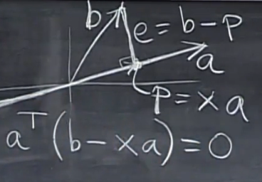

#投影(Projections)
向量也可以看做是一个一维的矩阵（只包含一个列向量），则向量a、b相交，则\\(a^{T}*b=0\\)
##向量的投影(1维空间)
现在有两个向量a、b，如下图  
  
则向量b在a上的投影为向量p，向量p为x倍的向量a，而向量e与向量a正交，则可以推出  
$$
a^{T}*(b - xa) = 0
$$
转换后可以得出
$$
x = \frac{a^{T}b}{a^{T}a}
$$
x包含夹角的信息等，投影向量 p = ax
$$
p = a\frac{a^{T}b}{a^{T}a}
$$
观察图象可以发现如果将向量b乘以一个数值，则其投影也会跟着变化相对应的倍数，若向量a发生变化，则其投影不会有任何影响
##投影矩阵
上式中
$$
p = a\frac{a^{T}b}{a^{T}a}
$$
可以记作
$$
p = \frac{aa^{T}}{a^{T}a}b \\\\
p = Pb \\\\
P = \frac{aa^{T}}{a^{T}a} 
$$
则可以当作投影向量p是一个向量P作用在向量b上形成的投影，若投影向量是一个矩阵作用在向量b上形成的，即P为一个矩阵，则成这个矩阵为投影矩阵。  
虽然不知道是为什么，但是P的列向量空间是一个穿过向量a的直线，也就是说是一个 rank(P) = 1  
####投影矩阵的属性
\\(P^{T} = P\\)即投影矩阵是对称的  
\\(P^{2} = P\\) 即投影两次与投影一次的结果是一样的，且其平方还等于其本身
##为什么要做投影
因为Ax=b可能会无解，因为Ax是在A的列空间中，而当b不在其空间中时，就会无解。此时我们需要求出最接近于有解的解，即进行向量b在A的列空间中的投影。即求出
$$
A\overline{x} = \overline{b} = p
$$
现在要求出投影p，如第一幅图中，将向量a扩展成高维度的矩阵A，则
$$
A^{T}(b-A\overline{x}) = 0
$$
##对于n为矩阵来说
$$
\overline{x} = (A^{T}A)^{-1}A^{T}b \\\\
p = A\overline{x} \\\\
P = A(A^{T}A)^{-1}A^{T}
$$