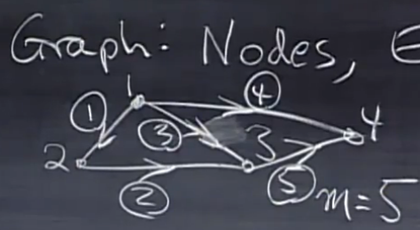

##图
  
以上图为例，每条边对应矩阵一行，每个顶点对应一列，上图可以写成
$$
\begin{bmatrix}
-1 & 1 & 0 & 0 \\\\
0 & -1 & 1 & 0 \\\\
-1 & 0 & 1 & 0 \\\\
-1 & 0 & 0 & 1 \\\\
0 & 0 & -1 & 1 \\\\
\end{bmatrix}
$$
其中-1表示起点1表示终点  
观察可以发现线路1、2、3形成了一个回路，且矩阵的前三行向量线性相关，
也就是说与回路对应的行是线性相关的
##网络