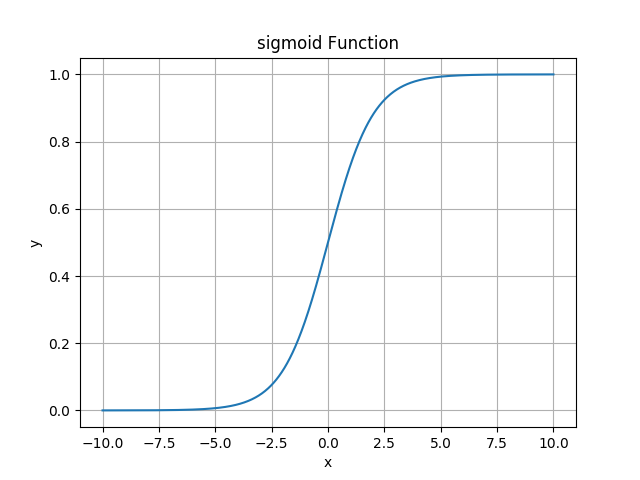

# 用于模型的分类
# Logistic回归
### 分类问题的首选算法
## Logistic/sigmoid函数
$$
f(x) = \frac{1}{1+e^{-x}}\\\\
f'(x) = f(x)(1-f(x))\\\\
h_\theta (x) = g(\theta ^T x)= \frac{1}{1+e ^{-\theta ^T x}}
$$

## 多分类问题:Softmax回归

## 信息熵

