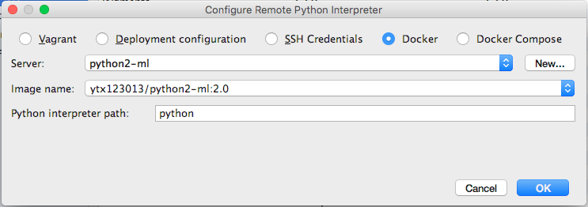

# 关于在PyCharm中设置Docker中的python环境
发现在电脑中用`virtualenv`设置python环境老出问题，就寻思着想个法代替，就用到了`Docker`，过程中遇到些坑，查了些资料解决了，就记下来

# 关于Docker
`Docker`就不说了，主要是要在本机上有python环境的image

# PyCharm中设置Docker
[原文在这](https://kawashi.me/docker-integration-in-pycharm-when-using-docker-for-mac.htmlhttps://kawashi.me/docker-integration-in-pycharm-when-using-docker-for-mac.html)
大概意思说的是现在的Mac上的Docker不提供`https URL`和`TCP`的服务，所以我们需要运用`socat`这个工具，利用`Homebrew`安装即可

```
brew install socat
```
安装完毕后直接运行即可

```
socat TCP-LISTEN:2375,reuseaddr,fork,bind=localhost 
UNIX-CONNECT:/var/run/docker.sock &
```

在PyCharm中`Preferences`->`Project Interpreter`中`Project Interpreter`选项的右边选择`Add Remote`并选择其中的`Docker`
新建一个设置后将`API URL`中改成

```
tcp://localhost:2375
```
`Certificates folder`中的内容清空即可

点击`OK`即可，就可以选择`Image name`了

其中自动补全的是你`image`中的库

破费~~~~

注：
Docker版本1.12.5
PyCharm版本2016.2.1

