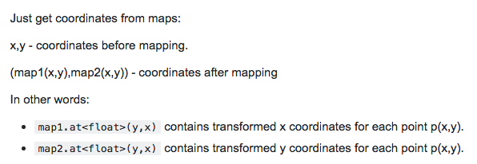

# Remapping
即可以将原图像按照某种规律将像素值映射到另一张图像上的特定位置。

```
remap(src,dst,map1,map2,interpolation);
dst(x,y) = src(map1(x,y),map2(x,y))
```
对于上式的一些解释引自stackoverflow

不知道为什么感觉map1和map2反了


```
h(x,y) = (I.cols - x,y)	  	//水平翻转
h(x,y) = (x,I.rows - y)		//垂直翻转
```


