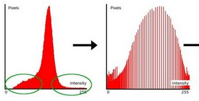

# 直方图
* 直方图是图像中像素强度分布的图形表达方式，它统计了每一个强度值所具有的像素个数
* 直方图是对数据集合对统计，并将统计结果分布在一系列与定义的bins中
* 我们可以对灰度值[0-255]定义不同的统计范围[0-15],[16-100]...等等的bins，并统计图像上的像素值在这些bins中的分布情况
* 直方图不仅仅可以统计图像的颜色灰度，还可以统计任何图像的特征

# 直方图均衡化
* 直方图均衡化是通过拉伸像素强度分布范围来增强对比度的一种方法。
* 以下方直方图为例，可以看到像素主要集中在中间的一些强度值上. 直方图均衡化要做的就是拉伸这个范围. 见下面左图: 绿圈圈出了 少有像素分布其上的 强度值. 对其应用均衡化后, 得到了右图所示的直方图，增强了原图的对比度。

