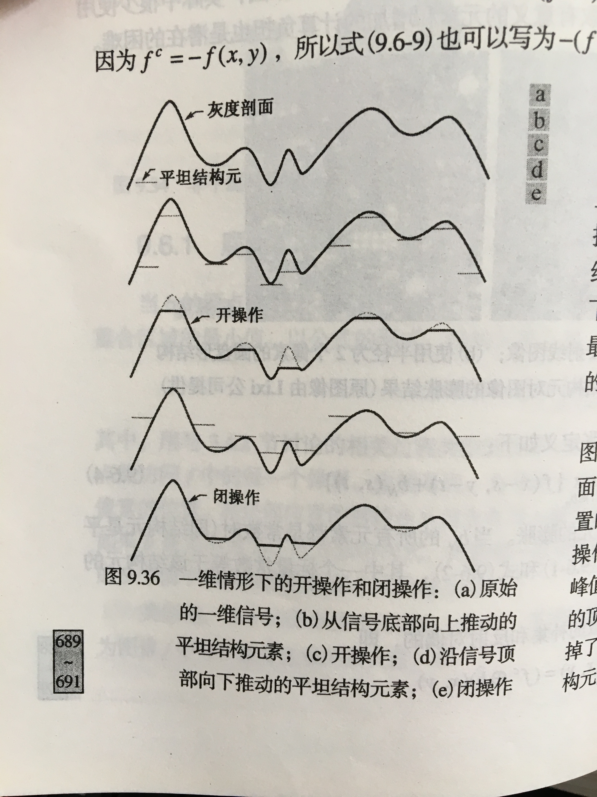

#  腐蚀和膨胀
腐蚀:cv::erode();
膨胀:cv::dilate();

# 开操作和闭操作
cv::morphologyEx();
开操作：先腐蚀，再膨胀  	去除亮点
闭操作：先膨胀，再腐蚀		去除暗点

# 灰度图的操作
###	平坦结构元和非平坦结构元
平坦结构元就是结构元的灰度值都是一样的，非平坦结构元是灰度不一样，附图

附图为平坦结构元的开闭操作示意图

# 形态学梯度
即膨胀与腐蚀的差，用于保留物体的边缘轮廓

# 顶帽和底帽变换
顶帽变换是原图像与开运算的结果图之差。
底帽变换是原图像与闭运算的结果图之差。
顶帽变换的一个重要用途是矫正不均匀的光照影响，这在从北京里提取目标的处理中扮演核心角色。
这些变换主要应用之一是，用一个结构元通过开或闭操作从一副图像中删除物体，而不是拟合被删除的物体。然后，差操作得到一副仅保留已删除分量的图像。顶帽变换用于暗背景上的亮物体，底帽则相反。

