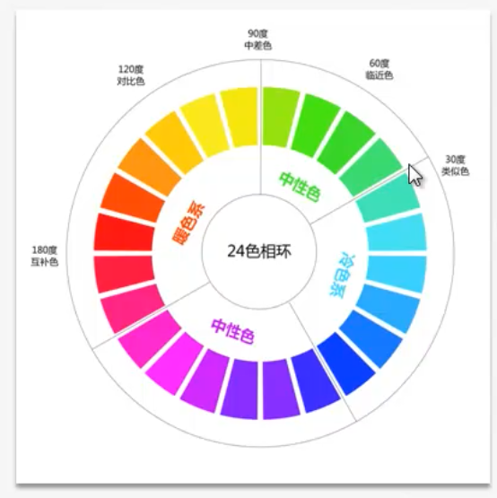
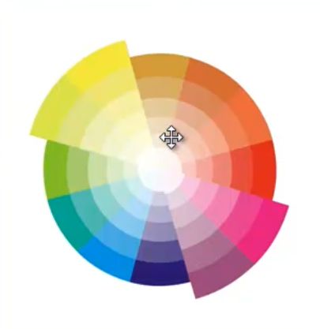
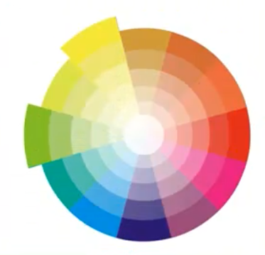
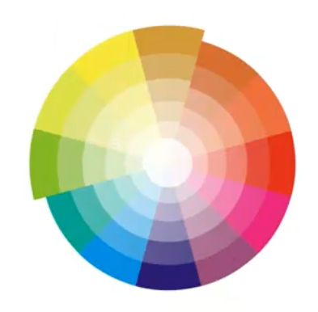

色彩没有单纯的好看与不好看之分  只有在色彩搭配的时候才会出现和谐与不和谐的差别
# 24色相环

# 12色相环中色彩的关系
[推荐阅读](http://www.shejidaren.com/浅谈色彩学：对比色配色.html)
### 互补色
对角之间180度的色彩关系是互补色

互补色的搭配可以使互为补色的色彩更加的显眼明亮，能产生很好的吸引眼球的效果。
通常也可以利用互补色搭配来突出主体，让主体渐渐融入背景元素，有助于刻画主体并使观众注意到你想让他们注意到的地方。

### 邻近色
60度相邻之间的色彩是邻近色

邻近色有着相同的"基因"，搭配在一起会有一种我中有你的的感觉，可以看出来是一个系列的颜色，有一种和谐和自然的感觉。
可以用一个系列的邻近色来表达某一种特征。

### 对比色
120度角之间的两个颜色为对比色

