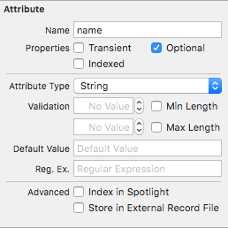
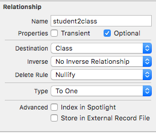

# 关于CoreData
类似于ORM这种框架，并不是具体的数据库，是对sqlite的上层封装。
CoreData只是将数据从本地保存至内存当中，在没有调用save之前，任何对DataModel的操作都不会同步至硬盘上，只是在内存中进行操作和修改。
# Attributes 属性

关于Entity的属性界面。
Properties:

1. Transient		勾选后该属性不会保存至数据库中，其余所有行为都与正常属性一样。
2. Optional
3. Indexed			为该字段创建一个数据库索引，建立索引会提高检索该属性的速度，但是会降低修改的性能。同时也会增加硬盘的储存空间。

# Relationships 关系
数据库设计:

1. 一对一：一方主键作为另一方外键
2. 一对多：一方主键作为多方外键
3. 多对多：用双方的主键新生成一张表并一一对应 

关于Relationship界面:

