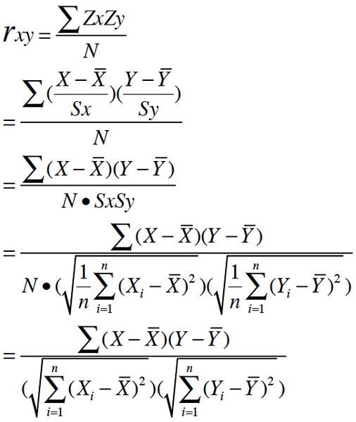
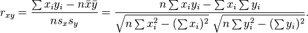

相关(Correlation,相关系数)，显示两个随机变量之间的线性的关系和强度和方向.

#皮尔逊系数 Pearson Correlation Coefficient
&emsp;&emsp;&nbsp;用于度量两个变量X与Y之间的线性相关性，1为完全正相关，0为无关，－1为完全负相关。
&emsp;&emsp;&nbsp;简单来看，皮尔逊系数可以看作是两组数据先做Z分数处理后，两组数据的乘积和除以样本数。
  
同时也可以写成  
  
注：详见[维基百科](https://en.wikipedia.org/wiki/Correlation_and_dependence#Pearson.27s_product-moment_coefficient)