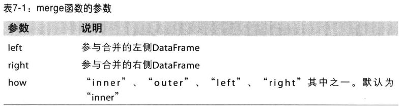
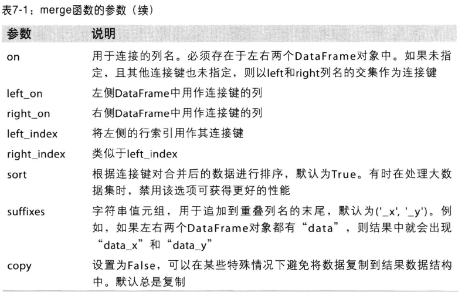
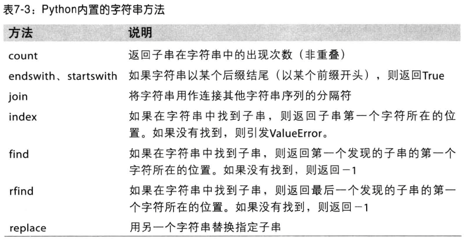
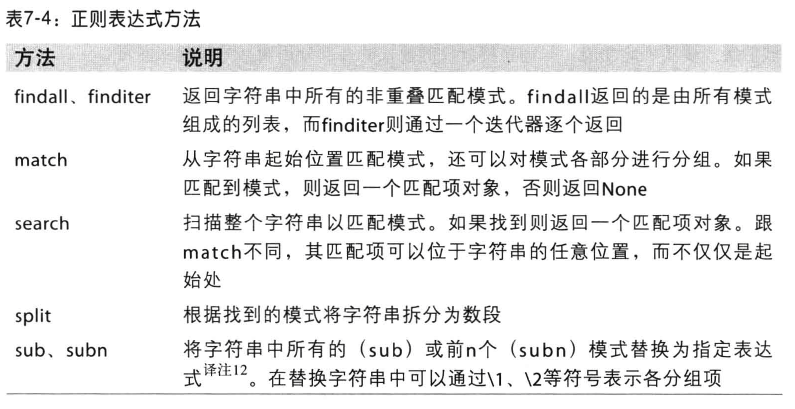
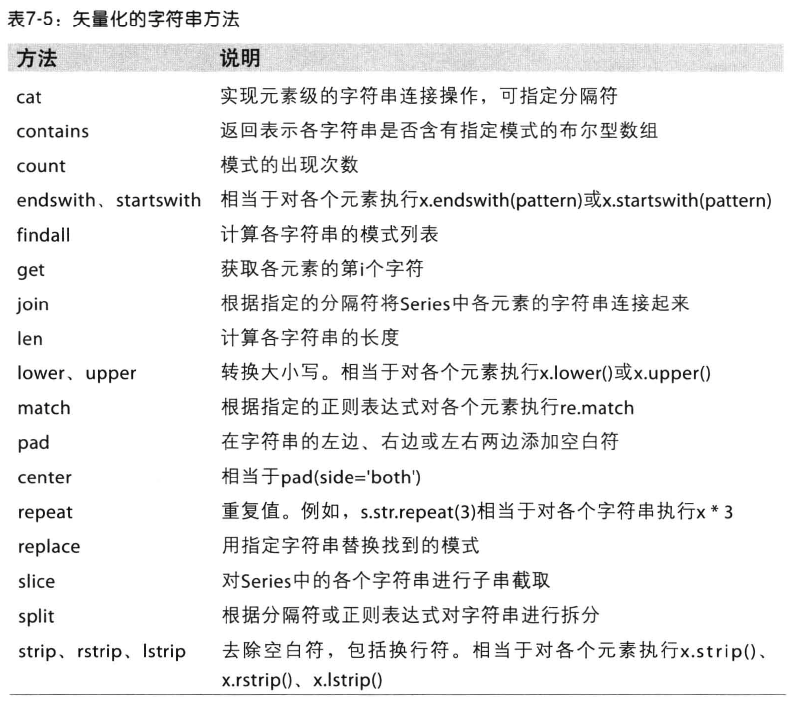

##数据合并
pd.merge(left,right)函数参数列表

##重塑和轴向旋转
DataFrame的pivot函数可以实现将一列内容作为行或列index

##计算指标/哑变量
哑变量矩阵(dummy matrix)  
通常统计建模、机器学习会将分类变量转换为哑变量矩阵(dummy matrix)或指标矩阵(indicator matrix)。如果DataFrame某一列列含有k个不同的值，则会产生一个k列的矩阵或DataFrame，其值全为0或1.
##字符串
Python内置字符串方法

##正则表达式
re模块函数可以分为三类:模式匹配、替换及拆分。  
直接调用re.split('\s+',aa)时，正则表达式会先被编译，然后再在aa上调用其split方法。也可以先re.complie自己编译regex得到一个可复用的regex对象：
<pre>
regex = re.compile('\s+')
regex.split(aa)
</pre>

对Series中字符串可以使用的方法,Series.str
