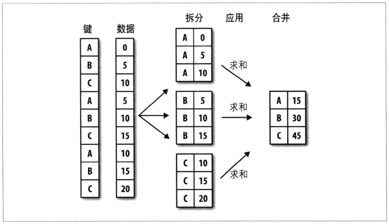
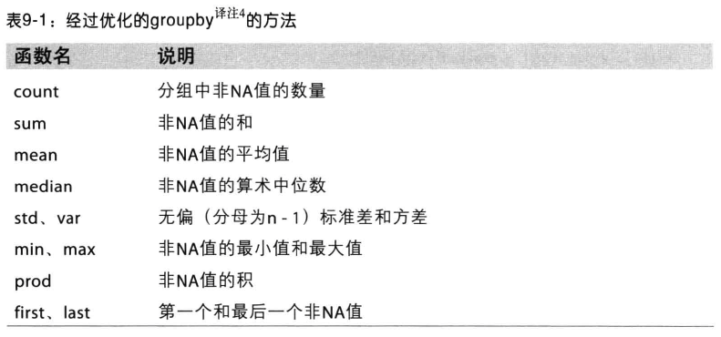
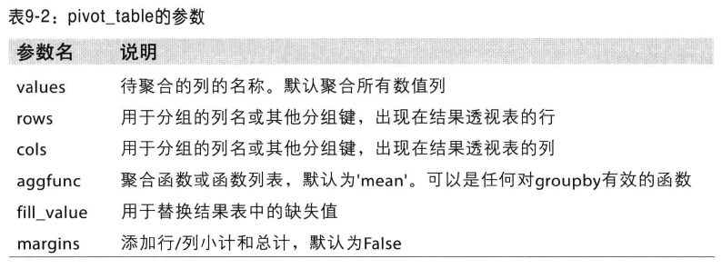

##GroupBy
split-apply-combine(拆分－应用－合并)  
pandas中Serise、DataFrame会根据所提供的一个或多个键拆分为组，DataFrame会在其行(axis=0)或列(axis=1)上进行分组，然后将一个函数应用到各个分组并产生一个新值。最后这些新值会被合并到最终的结果中。如下图就是一个简单的分组聚合过程，

##对分组的迭代
GroupBy对象支持迭代，可以产生一组二元元组(分组名和数据块构成)
##通过函数进行分组
可以通过传入函数进行分组，如
<pre>
people.groupby(len).sum()
</pre>

##数据聚合
能够实现于Series上的方法，同样可以实现于GroupBy，GroupBy会高效的对Series进行切片，然后对各片调用方法，最后将这些结果组成最终结果。
经过优化的可以使用的GroupBy方法

***
apply()  
apply会将待处理的对象拆分成多个片段，然后对各片段调用传入的函数，最后尝试将各片段组合在一起。  
如果传给apply的函数能够接受其他参数，则放在函数名后面一起穿入即可，自定义的函数只需返回一个pandas对象或标量值即可。

##分位数和桶分析
<pre>
frame = DataFrame({'data1': np.random.randn(1000),
                   'data2': np.random.randn(1000)})
factor = pd.cut(frame.data1,4)
grouped = frame.data2.groupby(factor)
</pre>
cut返回的factor可直接用于groupby

##透视表和交叉表(pivot table crosstab)

交叉表是一种用于计算分组频率的特殊透视表
