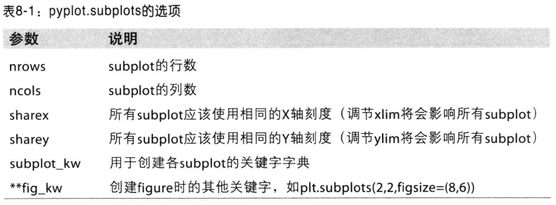

##Figure Subplot
matplotlib图像均位于Figure对象中  
<pre>
fig = plt.figure()  
</pre>
创建一个新的Figure，因为不能通过空的Figure绘图，必须用add_subplot创建一个或多个subplot才行
<pre>
ax1 = fig.add_subplot(2, 2, 1)
</pre>
表示图像应该是2x2的，且当前选中的是4个subplot中的第一个
<pre>
plt.plot([1,1,1,1])
</pre>
会在最后一个用过的subplot(若没有则创建一个),之后可以直接通过ax1对象进行绘图。
<pre>
fig, axes = plt.subplots(2,3)
</pre>
会直接创建一个新的Figure并返回fig和创建的subplot对象
<pre>
plt.gcf()
</pre>
可以得到当前Figure的引用

***
保存

##Pandas Plot
Series.plot参数

DataFrame.plot