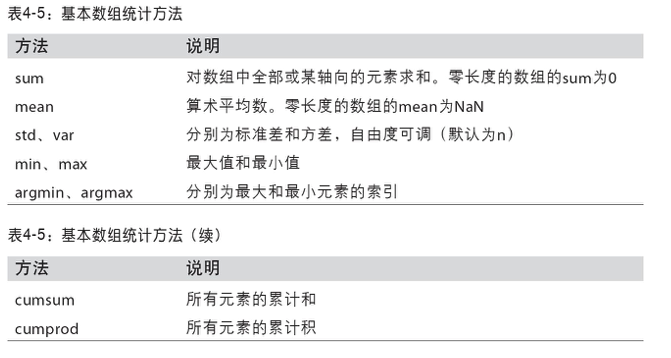

##ndarray
类型转换(astype)  
data = np.array([1,2,3,4,5,6,7])  
str_data = data.astype(np.string_)  
所有类型如下   

 

##通用函数

##利用数组处理数据(看不懂)
用数组表达式代替循环的做法，通常称为矢量化。是量化数组运算比等价纯python运算快一两个数量级。  
***
数学和统计方法  

***
排序  
data = np.randn(3,5)
data.sort(1)		按第一组(第一行)数据排序
***
唯一化及其他集合函数

##用于数组的文件输入输出
##线性代数

##随机数

  
