##Series
类似于一维数组对象，由一组数据和与之相关的标签(索引)组成。  
Series 也可以看成是一个定长的有序字典，索引就相当于键。

##DataFrame
可以看作由Series组成的字典。
能传给DataFrame构造器的数据
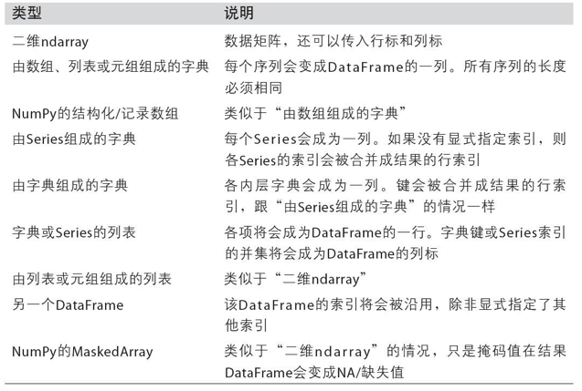
索引选项
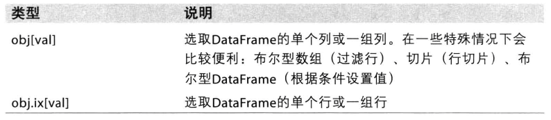
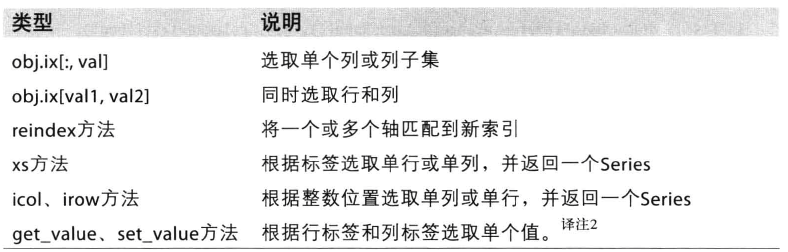

##索引对象
pandas索引对象负责管理轴标签和其他元数据。构成Series或DataFrame时，所用到的任何数组或其他序列的标签都会被转换成一个Index，并且Index对象不可修改。  
可以创建的Index对象类型
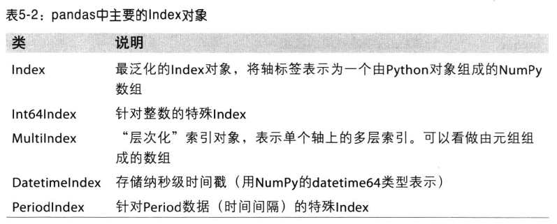
Index的方法和属性
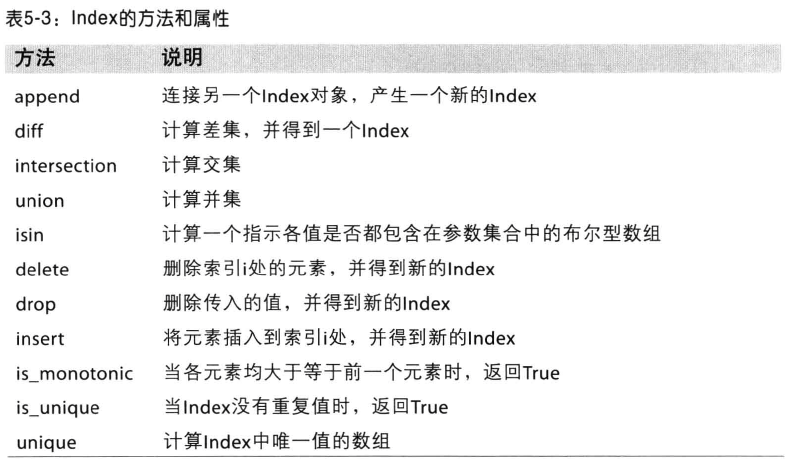
reindex函数的参数
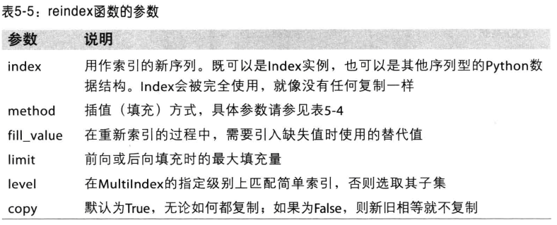
reindex的填充方法
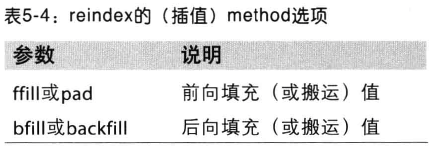

##算术运算和数据对齐
对不同索引的对象进行算术运算，如果存在不同索引dui，则结果的索引就是该索引对的并集.

##汇总统计和描述
所有描述统计的方法
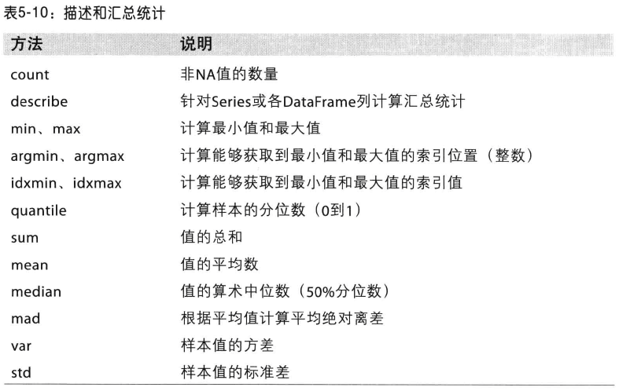
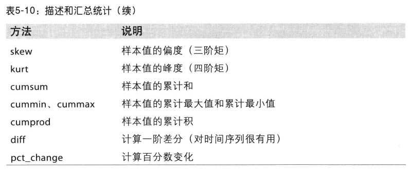
***
相关系数和协方差
Series的corr用于计算两个Series中重叠的、非NA的、按索引对齐的值的相关系数，cov用于计算协方差。  
DataFrame的corr和cov是以DataFrame形式返回一个矩阵。  
DataFrame的corrwith用于计算每一行或列与一个Series或DataFrame之间的相关系数。传入axis=1可以按行，默认axis＝0是按列。
***
唯一值、值计数、成员资格方法
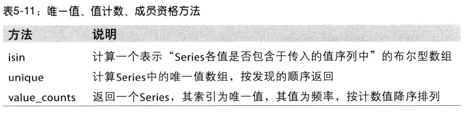
***
NA的处理函数
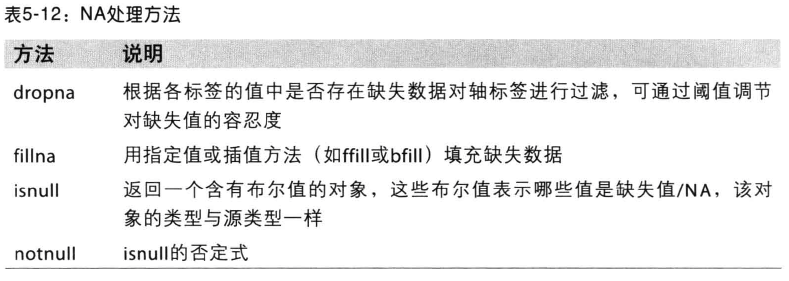
fillna函数的参数
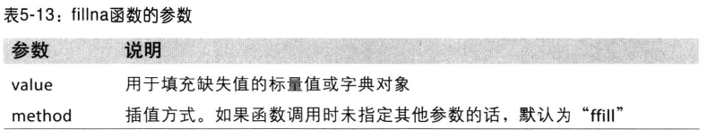
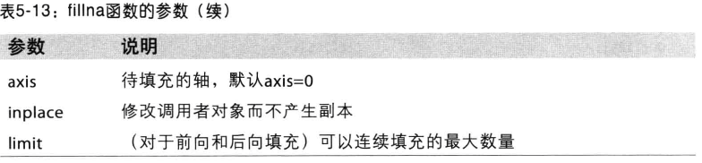