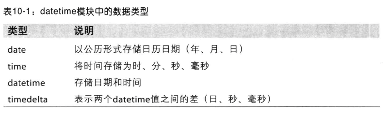
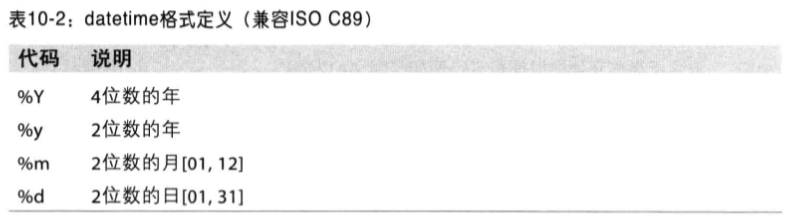
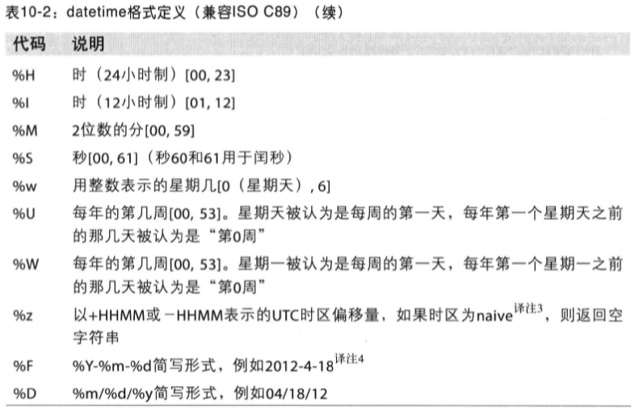
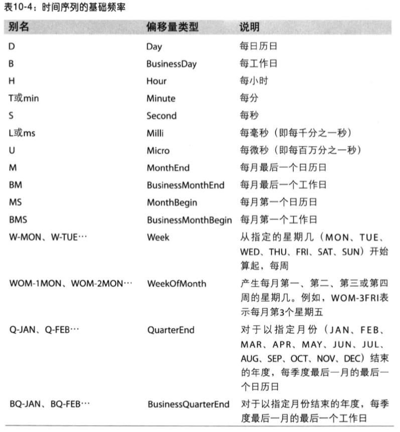
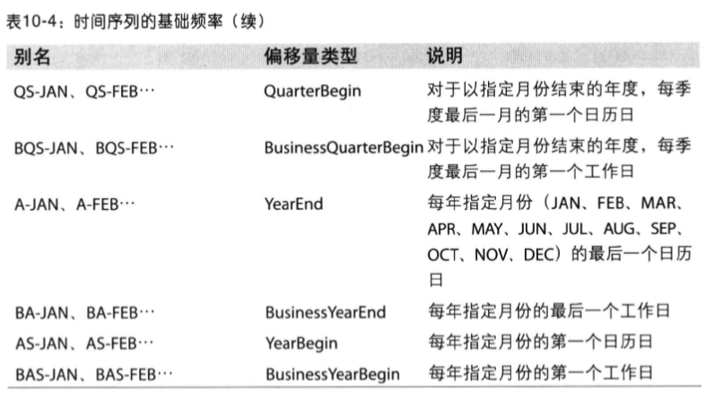
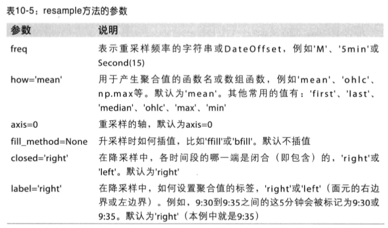
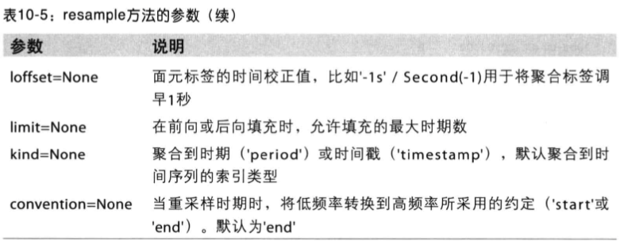
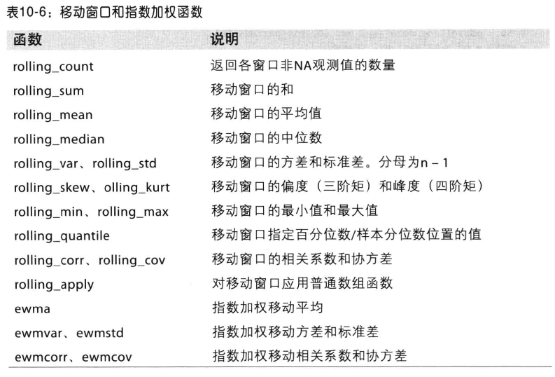

第三方库: dateutil
##日期

##时间序列基础
pandas最基本的时间序列类型是以时间戳为索引的Series
##时间序列频率

  
WOM日期，在freq参数中意WOM开头会增强其内容

##重采样
指的是将时间序列从一个频率转换到另一个频率的处理过程。

***
使用resample对数据进行降采样时，需要考虑两个问题：  

1. 各区间哪边时闭合的
2. 如何标记各个聚合面元，用区间的开头还是末尾  

##移动窗口函数
