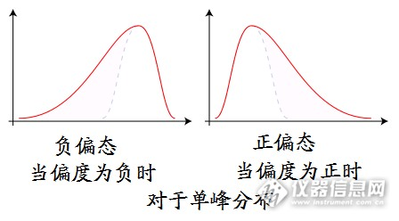
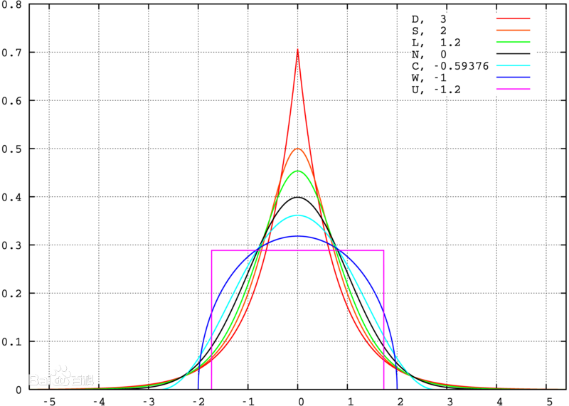

# k阶原点矩
k阶原点矩
$$
m_k = E(X^k)
$$
期望就是1阶原点矩，即
$$
\mu = m_1
$$

# k阶中心矩
$$
c_k = E(X-E(X))^k
$$
方差就是2阶中心矩，即
$$
D(X) = c_2
$$

# 偏度
$$
Skew(X) = \frac{c_3}{(c_2)^{\frac{3}{2}}} = \frac{c_3}{\sigma ^3}
$$
表示$X$概率密度函数图像的偏向问题，表示均值相对于峰值（众数）的偏向情况，正太分布的偏度为0

# 峰度
$$
Kurt(X) = \frac{c_4}{(c_2)^2} = \frac{c_4}{\sigma ^4}
$$
表示概率密度函数在均值处峰值高低的特征

