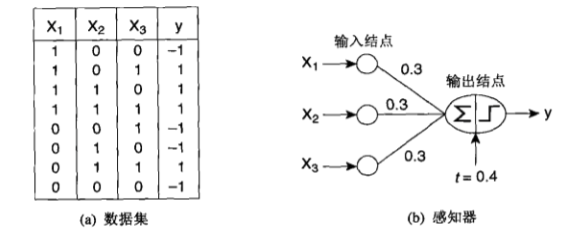
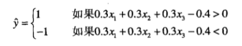

# 感知器
感知器为最简单的人工神经网络模型。

上图展示的就是一个感知器
包括:

1. 几个输入节点，用来表示输入属性
2. 一个输出节点，用来提供模型输出

在神经网络结构中通常叫做神经元或单位。
每个输入结点都通过一个加权的链连接到输入节点，训练一个感知器模型就相当于不断调整每个输入链的权值，直到能拟合训练数据的输入输出关系为止。
感知器对于加权求和后还需要减去偏置因子t，才能得到输出结果,如上图的模型输出为

