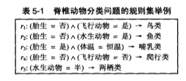

##基于规则的分类器
基于规则的分类器是实用一组"if...then..."规则来队记录进行分类的技术。  
  
上图表示一个分类问题，r1到r5称作规则，合称为一个规则集，根据规则取确定最终的结果。  

##排序
* 基于规则的排序
* 基于类的排序

##性质
基于规则的分类器产生的规则集有两个重要性质  
1. 互斥规则，规则集中不存在两条规则被同一条记录出发的情况，这样一条记录会产生两种结果。  
2. 穷举规则，如果对属性值的任意组合，规则集中都有一条规则可以覆盖，则称规则集R具有穷举覆盖。