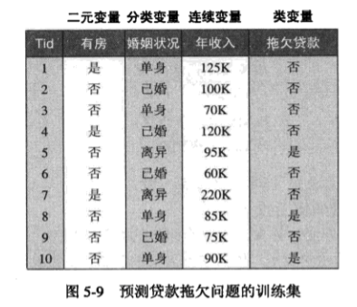

## 贝叶斯分类器
   在很多应用中，属性集和类变量之间的关系是不确定的，也就是说，尽管测试纪录的属性集和某些训练样例相同，但也不能正确的预测它的类标号。这种情况的产生可能是因为噪声，或者是出现了某些影响分类的因素并没有包含在分析中。
​	 本章介绍一种对属性集和类变量的概率关系的建模方法。
### 贝叶斯定理

​	 用于描述两个条件的概率关系，即
$$
P(Y|X) = \frac{P(X|Y)P(Y)}{P(X)}
$$
​	 即知道事件X、Y发生的概率和在X发生情况下发生Y的概率，可以求出时间Y发生的情况下发生X的概率。

### 贝叶斯定理在分类中的应用
​	 设X表示属性集，Y表示类变量，我们可以把X和Y看做成随机变量，并用\\(P(Y|X)\\)以概率的方式捕捉二者之间的关系。这个概率成为Y的后验概率，\\(P(Y)\\)成为先验概率。如下图
​	 
​	 假设Y＝1表示拖欠贷款，Y＝0表示未拖欠贷款，X=(有房＝否，婚姻状况＝已婚，年收入＝$120K),根据训练集中的数据计算后验概率\\(P(Y=0|X)\\)和\\(P(Y=1|X)\\),若\\(P(Y=0|X) > P(Y=1|X)\\)，则认为该属性集类型X下的分类标准为Y=0，即未拖欠。
​	 这样要准确估计类标号和属性值的每一种可能组合的后验概率很困难，因为即使属性数目不是很大但仍需要很大的训练集。这里P(X)与P(Y)好计算，直接计算在训练集中的比率即可，对于P(X|Y)介绍两种贝叶斯分类法：朴素贝叶斯和贝叶斯信念网络。
###朴素贝叶斯分类器
条件独立，若条件X、Y相互独立，结果为Z，则\\(P(X,Y|Z) = P(X|Z) * P(Y|Z)\\)
给定类标号y，朴素贝叶斯分类器在估计类条件概率时假设属性之间相互独立，则可以表示为
$$
P(X|Y=y) = \prod\limits_{i=1}^n P(X_i|Y=y)
$$
若有了条件独立假设，则不用计算X的每一种组合的类条件概率，只需计算每一个\\(X_{i}\\)的概率即可
$$
P(Y|X)=\frac{P(Y)\prod\limits_{i=1}^n P(X_{i}|Y)}{P(X)}
$$

##贝叶斯信念网络(BBN)
该方法不要求给定类的所有属性都独立，而是允许指定那些属性条件独立。
###模型表示
主要包含两个成份：
1.	 一个有向的无环图，表示变量之间的依赖关系。
2. 一个概率表，把各节点和它的直接父节点关联起来。

下图表示一个有向的无环图

除了变量的独立性和关联性外，每个节点还关联一个概率表，包括：
1. 如果节点X没有父节点，则表中只包含先验概率P(X)
2. 如果节点X只有一个父节点Y，则表中包含条件概率P(X|Y)
3. 如果节点X有多个父节点{Y1,Y2..Yn}，则表中应包含条件概率P(X|Y1,Y2,...,Yn}
如下图

