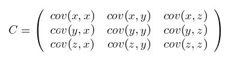

#汇总统计
汇总统计是量化的，使用单个数或者数的小集合捕获可能很大的数据集的特征。
##频率和众数
$$
频率=\frac{某一种值的数量}{总数量} 
$$
众数则是频率最高的值。  
##百分位数(percentile)
一组n个观测值按数值大小排列，处于p%位置的值称第p百分位数。
##位置度量：均值和中位数
均值是平均值  
中位数若是奇数则为最中间的数，若为偶数则为最中间两个数的平均数。
##散布度量：极差和方差
极差就是最大的数减去最小的数  
方差对离群值很敏感
$$
\frac{1}{n-1}\sum_{i=1}^n(x\_{i}-\bar x)^{2}
$$
标准差是方差的开平方
##多元汇总统计
包含多个属性的数据，数据的散步更多的使用协方差矩阵表示。
###协方差
标准差和方差一般使用来描述一维数组的，但现实中的数据集常常是多维，所以用协方差来描述两个变量的关系
$$
cov(X,Y)=\frac{\sum_{i=1}^n(X\_{i}-\bar X)(Y\_{i}-\bar Y)}{n-1}
$$
当协方差大于0时，表示一个变量变大，另一个变量也会跟着变大。  
当协方差等于0时，表示两个变量没有相关关系。   
当协方差小于0时，表示一个变量变大，另一个变量会跟着变小。  
注意：其绝对值不反应线性相关的程度，由协方差引出表示相关程度的相关系数
###协方差矩阵
将各个属性进行协方差运算，组成一个对称矩阵，其主对角线上各个值是各个属性的方差。如下图  

###相关系数
相关系数不仅表示线性相关的方向，还表示线性相关的程度，取值范围在-1到1之间。
$$
r = \frac{cov(X,Y)}{\sqrt{cov(X,X)}\sqrt{cov(Y,Y)}}
$$
即分好下面是X和Y的标准差。  
当相关系数越接近于1，线性关系越显著。  
一般当相关系数绝对值大于 \\(\frac{2}{\sqrt N}\\),N为样本点数量时，认为线性关系是存在的。