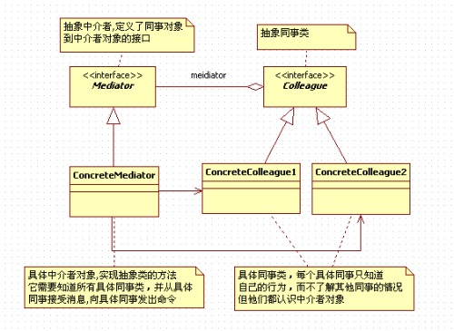

# 中介者模式
若模块A需要调用模块B的方法，B需要调用C的方法，C有需要调用A和B的方法，若再有模块D、E、F等等整个系统模块的依赖会很混乱。中介者模式就将这种混乱的依赖集中在一个中介者角色身上，每个模块需要与其它模块通信时必须要通过中介者角色的协作。
# 组成
中介者角色。
同事角色，也就是系统中的各个模块。
# 说明
所谓的中介者模式是用一个中介对象来封装一系列的对象交互，使得各个同事角色之间不需要显示的相互引用，可以更加独立的改变它们之间的交互。
将系统各个模块之间的引用关系由网状结构变成了星状结构。
引用一张别人的图片

# 一些思考
引用中介者是有缺点的，所以不要滥用。中介者模式适用于多个对象之间紧密耦合的情况，紧密耦合的标准是：在类途中出现了蜘蛛网状的结构。

